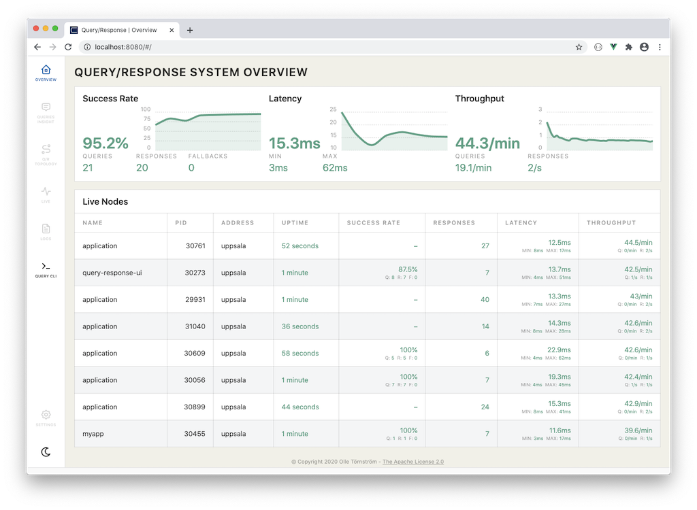

= Query/Response for Spring® AMQP

image:https://github.com/olle/spring-query-response-amqp/workflows/Java%20CI/badge.svg[title="Java CI", link="https://github.com/olle/query-response-spring-amqp/actions?query=workflow%3A%22Java+CI%22"] image:https://img.shields.io/lgtm/grade/java/g/olle/query-response-spring-amqp.svg?logo=lgtm&logoWidth=18[title="Language grade: Java", link="https://lgtm.com/projects/g/olle/query-response-spring-amqp/context:java"] image:https://badges.gitter.im/query-response-spring-amqp/community.svg[title="Join the chat!", link="https://gitter.im/query-response-spring-amqp/community"]

**WIP: Driving the initial version from this README, please feel free to
       provide feedback through issues.**

Build safer and more resilient distributed services. Get the benefits of an
_always async_ approach to data exchange. Ensure decoupling of components. Be
better prepared for system evolution. Create more scalable solutions. Change the
way you think and design, by using Query/Response for Spring AMQP.

== Batteries, included

Query/Response provides tools to allow developers to monitor, measure, explore
and discover the capabilities of their runtime system. Metrics and interactive
utilities, built-in.



== Quickstart

The Query/Response library can easily be added to any Spring Boot® project, as
a single dependency.

```xml
  <dependency>
    <!-- From Jitpack-repo -->
    <groupId>com.github.olle</groupId>
    <artifactId>query-response-spring-amqp</artifactId>
    <version>${SOME-TAG}</version>
  </dependency>
```

_At the current time we recommend using https://jitpack.io[Jitpack] to resolve
the dependency. Query/Response will however be published to the Sonatype OSS 
repository and Maven Central in the future._

=== `@EnableQueryResponse`

:QueryResponseConfiguration: link:./src/main/java/com/studiomediatech/queryresponse/QueryResponseConfiguration.java

To initialize the Query/Response library resources, and load the
{QueryResponseConfiguration}[`QueryResponseConfiguration`] class, the
`@EnableQueryResponse` annotation can simply be added to any Spring Boot 
application starter.

```java
@SpringBootApplication
@EnableQueryResponse
public class App {
  ...
}
```

The configuration will try to connect to an AMQP message broker, using the
common configurations for Spring AMQP. The default setup will try to connect
to a local broker with the username and password `guest/guest`.

_Please see the provided `examples/` for a simple setup with 
https://www.rabbitmq.com[RabbitMQ] as a docker container, to get you started._

== Queries

The fluid Query/Response API makes it easy for developers to understand and
decide on a strategy for service integration. Timeouts are _first-class
citizens_ in the API and protect against surprises.

```java
  var authors = queryBuilder.queryFor("authors", String.class)
                  .waitingFor(800)
                  .orEmpty();
```


== Responses

To create responding services we provide a really effective and expressive
fluid-API. Developers benefit from the declarative style, and won't have to
write any boilerplate code. It is easy to understand, work with and explore.

Very simple scenarios can quickly be created, for tests or proof of concept
work.

```java
  responseBuilder.respondTo("authors", String.class)
      .withAll()
      .from("William Gibson", "Isaac Asimov", "J.R.R. Tolkien");
```

== Documentation &amp; Examples

Read more and learn how to use Query/Response, and how it works, in the
https://olle.github.io/query-response-spring-amqp/[online documentation].

Also make sure to check out the working link:./examples/[examples] to get
started quickly with Query/Response.

== Versions &amp; Spring Boot

This project is very much an extension and amalgamation of the AMQP features
provided in Spring Boot. Therefore, there needs to be a living relationship
between the generational release versions of Spring Boot and this project.

We will build and tag an initial version `0.9.x` as a _preliminary_ working
version of Query/Response. This version is tracked in 3 branches, as well as
the `main` branch.

* `main`              -> Spring Boot 2.4.x
* `spring-boot-2.3.x` -> Spring Boot 2.3.x.RELEASE
* `spring-boot-2.2.x` -> Spring Boot 2.2.x.RELEASE
* `spring-boot-2.1.x` -> Spring Boot 2.1.x.RELEASE
* `spring-boot-1.5.x` -> Spring Boot 1.5.x.RELEASE

From each branch there will be tagged releases, denoting the version of Spring
Boot that it is built against. For example `0.9.0-SB2_3_6` means it was built
with the Spring Boot `2.3.6.RELEASE` dependency.

There will be no other minor version increment under the initial major version
`0.x.x`. The `0.9.x` version will be used to iron out bugs and gather feedback
for an upcoming `1.0.0` version.

Happy coding!

---

Spring and Spring Boot are trademarks of Pivotal Software, Inc. in the U.S. and
other countries.
