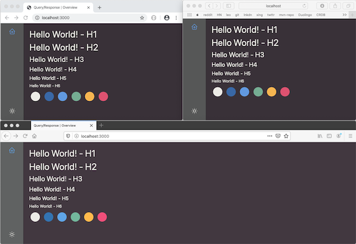

# Query/Response UI

**WIP: Driving the goals and implementation of the UI with this README, please
feel free to provide feedback and ideas through issues.**

The Query/Response UI helps you gain insights and observe your active service
landscape by providing rich information about how queries and responses are
flowing throughout the system.

## Getting started

The Query/Response UI makes use of the messaging network, and is _eating its
own dog food_, by using queries to gather information about the current active
system.

The simplest way to start the UI is to run it locally by issuing `make`. This
will start the Spring Boot® application. The Query/Response UI application is
served at http://localhost:8080 by default.

> The default Spring AMQP configuration will attempt to connect to a local
> broker on port 5672 with `guest/guest`. To use another RabbitMQ or other
> credentials you can provide the command line arguments:
>
> - `-Dspring.rabbitmq.host=hostname`
> - `-Dspring.rabbitmq.username=user`
> - `-Dspring.rabbitmq.password=password`
>
> Or set the environment variables:
>
> - `SPRING_RABBITMQ_HOST`
> - `SPRING_RABBITMQ_USERNAME`
> - `SPRING_RABBITMQ_PASSWORD`.

## Development

The Query/Response UI is intended to be a rather _thick client_ or _Single Page
Application (SPA)_. It is built with the [Vue] framework. It is easy to start
in development mode, using the `make dev` target. The Vue application is
available at http://localhost:3000.

[vue]: https://vuejs.org

The SPA source files and modules can all be found under `src/main/web`.

### Spring Boot Backend

The client SPA is both served and supported by a Java, Spring Boot application.
The backend supports web sockets, and publishes updates to the client UI.

There is currently no command, RPC or REST-ful API in the backend.

Happy hacking!

### Architecture & Design

---

Spring Boot is a trademark of Pivotal Software, Inc. in the U.S. and other
countries.
